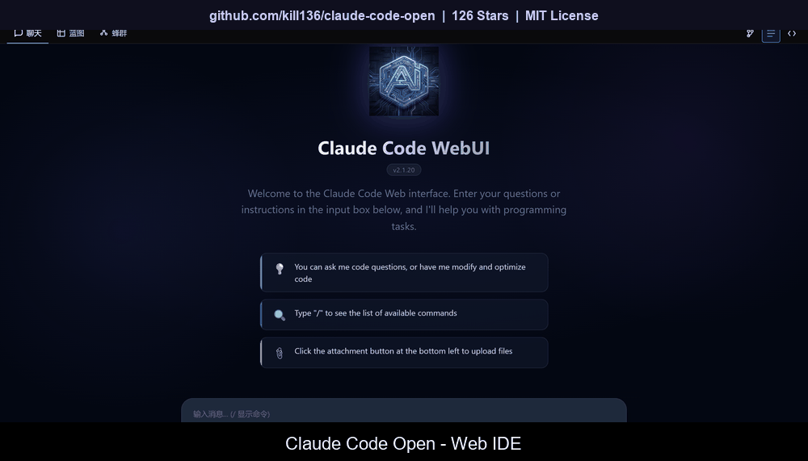
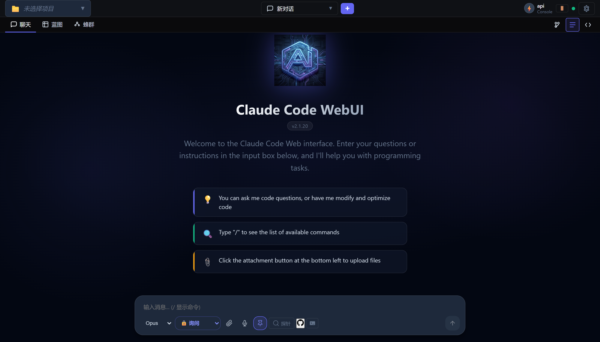
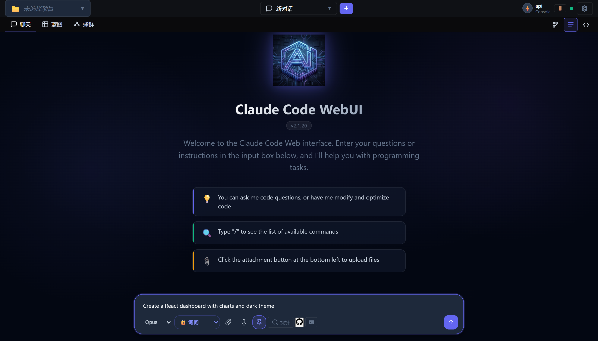
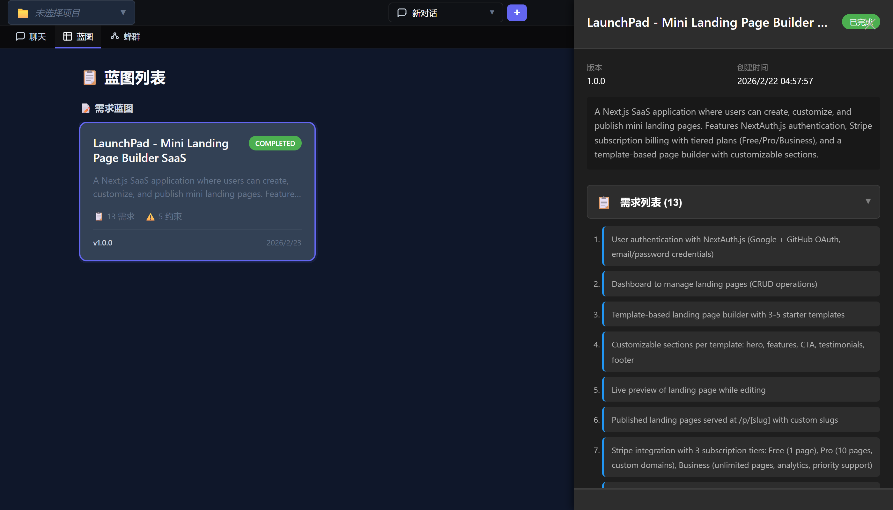

<div align="center">

# Axon

### 开源 AI 编程助手，支持 Web IDE、多智能体协作、自我进化

**任意模型。插件扩展。让 AI 帮你搭建整个项目。**

[](https://www.npmjs.com/package/axon)
[](https://github.com/kill136/claude-code-open)
[](LICENSE)
[](https://nodejs.org)
[](https://discord.gg/bNyJKk6PVZ)

[官网](https://www.chatbi.site) | [在线体验](https://voicegpt.site) | [操作手册](https://www.chatbi.site/zh/user-guide.html) | [Discord](https://discord.gg/bNyJKk6PVZ) | [English](README.md)

<a href="https://voicegpt.site">

</a>

<sub><a href="https://youtu.be/OQ29pIgp5AI">YouTube 观看</a> | <a href="https://github.com/kill136/claude-code-open/releases/download/v2.1.37/promo-video.mp4">下载视频</a> | <a href="https://voicegpt.site">在线体验</a></sub>

</div>

---

Axon 是一个免费、开源的 AI 编程助手，内置 Web IDE、多智能体任务系统和自我进化能力。你拥有完全的控制权 —— 自由选择 AI 服务商，通过插件和 MCP 服务器扩展功能，甚至可以让 AI 修改它自己的源代码。

## 快速开始

```bash
# 安装
npm install -g axon

# 设置 API Key（支持 Anthropic、OpenRouter、DeepSeek 等任意 OpenAI 兼容服务商）
export ANTHROPIC_API_KEY="sk-..."

# 终端模式
axon

# Web IDE 模式（打开 http://localhost:3456）
axon-web
```

### 其他安装方式

<details>
<summary>一键安装（无需 Node.js）</summary>

**Windows：** 下载 [install.bat](https://github.com/kill136/claude-code-open/releases/latest/download/install.bat) 双击运行。

[Gitee 国内镜像](https://gitee.com/lubanbbs/claude-code-open/raw/private_web_ui/install.bat)

**macOS / Linux：**
```bash
curl -fsSL https://raw.githubusercontent.com/kill136/claude-code-open/private_web_ui/install.sh | bash
```

**国内镜像：**
```bash
curl -fsSL https://gitee.com/lubanbbs/claude-code-open/raw/private_web_ui/install.sh | bash
```
</details>

<details>
<summary>Docker</summary>

```bash
# Web IDE
docker run -it \
  -e ANTHROPIC_API_KEY=your-api-key \
  -p 3456:3456 \
  -v $(pwd):/workspace \
  -v ~/.axon:/root/.axon \
  wbj66/axon node /app/dist/web-cli.js --host 0.0.0.0

# 仅终端
docker run -it \
  -e ANTHROPIC_API_KEY=your-api-key \
  -v $(pwd):/workspace \
  -v ~/.axon:/root/.axon \
  wbj66/axon
```
</details>

<details>
<summary>从源码构建</summary>

```bash
git clone https://github.com/kill136/claude-code-open.git
cd claude-code-open
npm install && npm run build
node dist/cli.js        # 终端
node dist/web-cli.js    # Web IDE
```
</details>

<details>
<summary>卸载</summary>

**macOS / Linux：**
```bash
curl -fsSL https://raw.githubusercontent.com/kill136/claude-code-open/private_web_ui/uninstall.sh | bash
```

**国内镜像：**
```bash
curl -fsSL https://gitee.com/lubanbbs/claude-code-open/raw/private_web_ui/uninstall.sh | bash
```

**Windows（PowerShell）：**
```powershell
irm https://raw.githubusercontent.com/kill136/claude-code-open/private_web_ui/uninstall.ps1 | iex
```

**Windows（cmd）：**
```cmd
curl -fsSL https://raw.githubusercontent.com/kill136/claude-code-open/private_web_ui/uninstall.bat -o uninstall.bat && uninstall.bat
```
</details>

## Axon 的独特之处

### Web IDE

完整的浏览器 IDE —— 不是聊天窗口。

- **Monaco 编辑器**，多标签页、语法高亮、AI 悬浮提示
- **文件树**，右键上下文菜单，VS Code 体验
- **AI 增强编辑** —— 选中代码问 AI，获得行内修改
- **WebSocket 实时流式**响应
- **会话管理** —— 创建、恢复、分叉、导出
- **检查点与回退** —— 文件快照和时间旅行

<table>
<tr>
<td></td>
<td></td>
</tr>
</table>

### 多智能体蓝图系统

给 Axon 一个复杂任务，它会自动拆解成多个 AI Agent 并行执行。

- **规划器** 将任务分解为执行图
- **Lead Agent** 协调 Worker，追踪进度
- **Worker** 独立执行，拥有完整工具权限
- **任务队列** 基于优先级调度，支持持久化
- **自动评审** 验证输出后才标记完成



### 自我进化

Axon 可以修改自身源码、编译 TypeScript、热重载 —— 随时增加新工具和新能力。

```
你：「增加一个查询天气的工具」
Axon：*编写工具代码，编译，重启，工具立即可用*
```

### 37+ 内置工具

| 类别 | 工具 |
|---|---|
| 文件操作 | Read, Write, Edit, MultiEdit, Glob, Grep |
| 执行 | Bash, 后台任务, 定时任务 |
| Web | 抓取网页, 搜索互联网 |
| 代码 | Jupyter Notebook, LSP, Tree-sitter 解析 |
| 浏览器 | 基于 Playwright 的全浏览器自动化 |
| 规划 | 规划模式, 蓝图, 子代理 |
| 记忆 | 长期记忆，语义搜索, 向量存储, BM25 |
| 集成 | MCP 协议, 技能市场, 插件 |
| 感知 | 摄像头（Eye）, 麦克风（Ear）, 语音（Mouth） |

### 可扩展架构

- **MCP 协议** —— 接入任意 [Model Context Protocol](https://modelcontextprotocol.io/) 服务器
- **Skills** —— 社区贡献的提示词技能（PDF、DOCX、XLSX、PPTX 等）
- **插件** —— 编写自定义 JavaScript/TypeScript 扩展
- **Hooks** —— 工具执行前后的回调
- **运行时自定义工具** —— 创建的工具跨会话持久化

### 支持任意 AI 服务商

| 服务商 | 配置 |
|---|---|
| **Anthropic** | `ANTHROPIC_API_KEY=sk-ant-...` |
| **OpenRouter** | `ANTHROPIC_BASE_URL=https://openrouter.ai/api/v1` |
| **AWS Bedrock** | `CLAUDE_CODE_USE_BEDROCK=1` |
| **Google Vertex AI** | `CLAUDE_CODE_USE_VERTEX=1` |
| **任意 OpenAI 兼容** | 设置 `ANTHROPIC_BASE_URL` 指向你的端点 |

### 代理服务器

将你的 API Key 或 Claude 订阅共享给局域网内的其他设备。

```bash
# 宿主机（持有 API Key 的机器）
axon-proxy -k my-secret

# 客户端
export ANTHROPIC_API_KEY="my-secret"
export ANTHROPIC_BASE_URL="http://<宿主机IP>:8082"
axon
```

<details>
<summary>代理服务器参数</summary>

| 参数 | 默认值 | 说明 |
|---|---|---|
| `-k, --proxy-key` | 自动生成 | 客户端连接密钥 |
| `-p, --port` | `8082` | 监听端口 |
| `-H, --host` | `0.0.0.0` | 绑定地址 |
| `--anthropic-key` | 自动检测 | 手动指定 Anthropic API Key |
| `--auth-token` | 自动检测 | 手动指定 OAuth Access Token |
| `--target` | `https://api.anthropic.com` | 上游 API 地址 |

代理服务器按优先级自动检测凭据：`ANTHROPIC_API_KEY` 环境变量 > `~/.axon/.credentials.json`（OAuth）。
</details>

## 配置

| 变量 | 说明 | 默认值 |
|---|---|---|
| `ANTHROPIC_API_KEY` | API 密钥（必填） | - |
| `ANTHROPIC_BASE_URL` | 自定义 API 端点 | `https://api.anthropic.com` |
| `AXON_LANG` | 语言（`en`/`zh`） | 自动检测 |
| `AXON_CONFIG_DIR` | 配置/数据目录 | `~/.axon` |

### MCP 服务器

在 `.axon/settings.json` 中添加外部工具服务器：

```json
{
  "mcpServers": {
    "filesystem": {
      "type": "stdio",
      "command": "npx",
      "args": ["-y", "@modelcontextprotocol/server-filesystem", "/path"]
    }
  }
}
```

## CLI 参考

```bash
axon                          # 交互模式
axon "分析这个项目"              # 带初始 prompt
axon -p "解释这段代码"           # 打印模式（非交互）
axon -m opus "复杂任务"         # 指定模型
axon --resume                 # 恢复上次会话
axon-web                      # Web IDE
axon-web -p 8080 -H 0.0.0.0  # 自定义端口
axon-web --ngrok              # 公网隧道
axon-web --evolve             # 自我进化模式
```

## 社区

- **官网：** [chatbi.site](https://www.chatbi.site)
- **在线体验：** [voicegpt.site](https://voicegpt.site)
- **Discord：** [加入我们](https://discord.gg/bNyJKk6PVZ)
- **X (Twitter)：** [@wangbingjie1989](https://x.com/wangbingjie1989)
- **微信：** h694623326

## 贡献

欢迎 PR 和 Issue！查看 [CONTRIBUTING.md](CONTRIBUTING.md) 了解指南。

### 编写 Skill 或插件

扩展 Axon 最快的方式是写一个 **Skill**（结构化提示词文件）或 **Plugin**（JS/TS 模块）。它们分别从 `~/.axon/skills/` 和 `~/.axon/plugins/` 自动加载。

## 赞助

Axon 免费开源，赞助帮助我们持续开发。[查看赞助层级 →](SPONSORS.md)

### 创始赞助者

- **Jack Darcy** — jack@jackdarcy.com.au

*你的名字/Logo 也可以出现在这里 — [成为赞助者](SPONSORS.md)*

<a href="https://github.com/sponsors/kill136"></a>
<a href="https://www.paypal.com/cgi-bin/webscr?cmd=_donations&business=694623326%40qq.com&item_name=Support+Axon+Development&currency_code=USD"></a>

<p>
&nbsp;&nbsp;&nbsp;

</p>

## 许可证

MIT

[English README](README.md)
