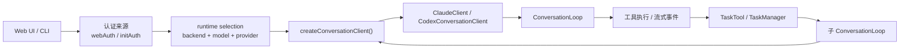

# 多模型运行时架构收敛（2026-03）

## 背景

项目最早是围绕 Claude 工作流设计的，核心循环、认证、工具流和子 agent 机制都天然带有 Anthropic 协议假设。现在产品已经同时支持：

- Claude Subscription
- Claude-Compatible API
- Codex Subscription
- OpenAI-Compatible API
- Axon Cloud（同一 backend 下可能承载 Claude / GPT 混合模型）

最近 `Task` / 子 agent 在 GPT 系列模型下暴露的问题说明：当前系统已经不再适合继续按“Claude 主干 + 其他 provider 适配补丁”演进，必须把多模型运行时正式收敛为一等架构能力。

这不是“从零重写”的信号，而是“从 Claude-first 升级到 runtime-first”的信号。

## 当前真实架构

当前实现里，相关职责大致分布在这些位置：

- 运行时选择：`src/web/server/runtime/runtime-selection.ts`
- backend/provider/model 共享规则：`src/web/shared/model-catalog.ts`
- client 工厂：`src/web/server/runtime/factory.ts`
- 主循环：`src/core/loop.ts`
- Web 会话编排：`src/web/server/conversation.ts`
- CLI/通用子 agent：`src/tools/agent.ts`
- Web 子 agent：`src/web/server/task-manager.ts`
- OpenAI/Codex 适配：`src/web/server/runtime/codex-client.ts`

## 当前主要问题

### 1. 四种维度混在一起

现在系统里至少存在四个不同概念：

- `runtimeBackend`：请求应该走哪条后端链路
- `provider`：当前协议族是 `anthropic` 还是 `codex`
- `model`：实际请求模型 ID
- capability：是否支持动态模型目录、Responses、thinking 档位、工具流事件、默认 base URL 等

问题在于，这四者现在还没有完全拆开，很多逻辑仍然在互相猜：

- 由 `provider === 'codex'` 推 capability
- 由模型名前缀推 provider
- 由历史 `customModelName` 反推 backend
- 同时保留 `runtimeProvider` / `apiProvider` / `provider` 多套概念

这会导致“主对话能跑，但外围链路错位”的问题反复出现。

### 2. `ConversationLoop` 仍然偏 Claude 内核

`src/core/loop.ts` 已经可以接收 `ConversationClientConfig`，这是重要进步，但它仍然保留了不少 Anthropic-first 的内核假设，例如：

- 默认 client 构造仍然从 `ClaudeClient` 语义出发
- cache keepalive 只对 Anthropic 有意义
- 工具流处理历史上主要围绕 Claude 的 event 形状设计
- 子 agent 默认模型语义仍然沿用 `opus/sonnet/haiku`

这意味着 loop 目前更像“支持多 provider 的 Claude loop”，而不是“provider-neutral loop”。

### 3. 子 agent 启动链路仍然双轨

子 agent 现在有两条主要入口：

- `src/tools/agent.ts`
- `src/web/server/task-manager.ts`

虽然这次已经修掉了 GPT runtime 下会偷偷掉回 `ClaudeClient` 的问题，但模型归一化、runtime 选择、client 配置透传仍然分散在两边。只要后续再引入新的 backend 特性，两边继续漂移的概率很高。

### 4. 外围能力判断仍然容易走偏

多模型问题并不只发生在对话本身，还会出现在外围链路：

- 测试连接
- 拉模型目录
- 默认 base URL
- OAuth 刷新
- thinking 档位映射
- 工具输入流补全
- 会话恢复后的 client 重建

如果这些能力继续由 provider 名字或模型正则来推断，Axon Cloud、OpenAI-Compatible、未来新增 backend 都会继续出现“部分功能可用、部分功能错位”的碎裂状态。

### 5. `ConversationManager` 职责过重

`src/web/server/conversation.ts` 现在同时承担：

- runtime/backend/model 解析
- client 构建与重建
- OAuth 有效性维护
- WebSocket 会话管理
- Task 透传
- ScheduleTask inline 执行
- 历史恢复

这会让任何运行时相关调整都变成高耦合改动，也让回归风险快速扩大。

## 结论

应该从头梳理“架构边界”，但不应该从头重写“业务功能”。

更准确地说，下一阶段应当做的是：

1. 停止继续把多模型支持当成局部兼容层。
2. 明确把 runtime/backend/capability 提升为核心抽象。
3. 用渐进收敛替代一次性重写。

## 目标架构原则

### 原则 1：`runtimeBackend` 是一级路由维度

所有出站运行时路径，先由 `runtimeBackend` 决定走哪条 backend 线路，再谈 provider/model。

### 原则 2：`provider` 只表示协议族，不承载业务能力判断

`provider` 应只回答一个问题：当前 client 适配 Anthropic 协议还是 Codex/OpenAI 协议。

它不应该再决定：

- 是否支持动态模型目录
- 是否支持某档 thinking
- 默认走哪个 base URL
- 该使用哪套工具流补全策略

这些应由 capability 决定。

### 原则 3：`model` 只是 backend 上的具体标识

模型名不应该再承担“顺便猜 provider/capability/backend”的职责。

### 原则 4：capability 必须中心化

建议把下面这些能力收敛为统一 capability 表，而不是散落在各文件 `if/else`：

- `supportsDynamicModelCatalog`
- `supportsResponsesApi`
- `supportsChatCompletionsFallback`
- `supportsReasoningEffortXHigh`
- `supportsAnthropicPromptCacheKeepalive`
- `supportsServerToolStreaming`
- `supportsToolUseCompleteOnly`
- `requiresOAuthRefresh`
- `defaultBaseUrl`

### 原则 5：子 agent 只能复用父 runtime，不再自行猜测

任何 child agent、Task、ScheduleTask、Blueprint worker 启动时，都应该直接拿父级已经解析好的 runtime config / capability snapshot，而不是重新从零解析一遍当前环境。

## 建议的模块边界

### 1. Runtime Descriptor 层

职责：

- 输入 `runtimeBackend + stored model + credentials`
- 输出统一 descriptor：`provider + normalizedModel + capabilities + baseUrl policy`

建议收敛位置：

- 保留 `src/web/server/runtime/runtime-selection.ts`
- 新增 `src/web/server/runtime/capabilities.ts`
- 逐步让 `src/web/shared/model-catalog.ts` 更偏纯数据与纯规则

### 2. Conversation Client Adapter 层

职责：

- descriptor -> 具体 client
- 只关心协议适配，不关心业务会话

现有入口：

- `src/web/server/runtime/factory.ts`
- `src/web/server/runtime/codex-client.ts`
- `src/core/client.ts`

目标：

- 工厂只吃统一 config
- loop 不再了解具体 client 的 provider 特例

### 3. Loop Protocol Normalizer 层

职责：

- 把不同 provider 的流式事件归一化成统一事件协议
- `ConversationLoop` 只消费统一事件，不理解 provider 原始事件差异

这层现在有一部分逻辑散落在：

- `src/web/server/runtime/codex-client.ts`
- `src/core/loop.ts`
- `src/web/server/runtime/tool-input-normalizer.ts`

后续应进一步收口。

### 4. Runtime Session Service 层

职责：

- 管理 Web 会话内的当前 runtime descriptor
- 凭据变更后重建 client
- 为 Task / Blueprint / ScheduleTask 提供统一 child runtime config

现在这些职责大量混在 `src/web/server/conversation.ts`。

### 5. Child Agent Launcher 层

职责：

- 统一创建子 agent loop
- 统一透传 runtime config、tool policy、max turns、messages

目标：

- CLI 和 Web 共用同一个子 agent 启动核心
- `src/tools/agent.ts` 与 `src/web/server/task-manager.ts` 只保留各自调用场景差异

## 迁移顺序

### 阶段 1：概念收敛

先做“名词统一”和“中心规则统一”，不急着大搬家。

优先事项：

- 明确 backend/provider/model/capability 四层含义
- 新建 capability 注册表
- 清理由 provider/model 正则直接推外围能力的分支

完成标准：

- 新增 backend 时，外围能力判断只改一处中心表

### 阶段 2：Loop 去 Claude 假设

优先事项：

- 把 `ConversationLoop` 中的 Anthropic 特例继续下沉
- 让 keepalive、tool stream completion、thinking 兼容都由 capability 驱动
- 默认模型 alias 只在 Anthropic-family 语境里解释

完成标准：

- `ConversationLoop` 构造时不再需要知道“是不是 Claude 风格”

### 阶段 3：子 agent 启动链路合并

优先事项：

- 提炼统一 child runtime launcher
- CLI/Web 两条 Task 链路共用同一套 runtime snapshot 透传
- Blueprint / ScheduleTask 也复用同一入口

完成标准：

- 主会话换 backend 后，所有 child agent 都不再单独做 provider 猜测

### 阶段 4：外围链路全面 capability 化

优先事项：

- 测试连接
- 模型目录
- 默认 base URL
- thinking 档位
- 工具流兼容
- OAuth 刷新

完成标准：

- 同一 backend 的“聊天、配置页、Task、恢复、测试连接”行为一致

### 阶段 5：测试矩阵补齐

回归测试至少按下面维度覆盖：

- backend：Claude / Claude-Compatible / Codex / OpenAI-Compatible / Axon Cloud
- 入口：主对话 / Task / ScheduleTask / Session restore
- 事件：文本 / thinking / tool_use_start / tool_use_complete / stream failure
- 凭据：apiKey / oauth / refresh / credential swap

## 明确不做的事

- 不做一次性大重构后再补回归
- 不把 provider-neutral 目标变成“所有 provider 逻辑都塞进 loop”
- 不引入新的“临时兼容字段”继续扩大概念漂移
- 不为了短期接更多模型，继续复制一套新的 runtime 分支

## 近期执行建议

如果按投入产出比排序，下一批最值得立即推进的是：

1. 增加统一 capability 表，并把外围能力判断切过去。
2. 提炼 child runtime launcher，合并 `TaskTool` 与 Web `TaskManager` 的子 agent 启动逻辑。
3. 继续从 `ConversationLoop` 抽走 Anthropic-only 行为。
4. 建立多 backend 回归矩阵，先覆盖主对话和 Task。

## 验收标准

当下面这些问题都可以稳定回答“只看 runtime descriptor 就够了”时，说明收敛基本成功：

- 当前请求该走哪个 client？
- 默认 base URL 是什么？
- 该模型是否支持当前 thinking 档位？
- 工具输入应该从 delta 还是 complete 补全？
- 子 agent 是否会继承到正确 runtime？
- 会话恢复后是否会重建成正确 client？
- `/api/models` 和聊天实际可用模型是否一致？

在那之前，项目仍然处于“多模型可用，但架构尚未完全收敛”的阶段。
